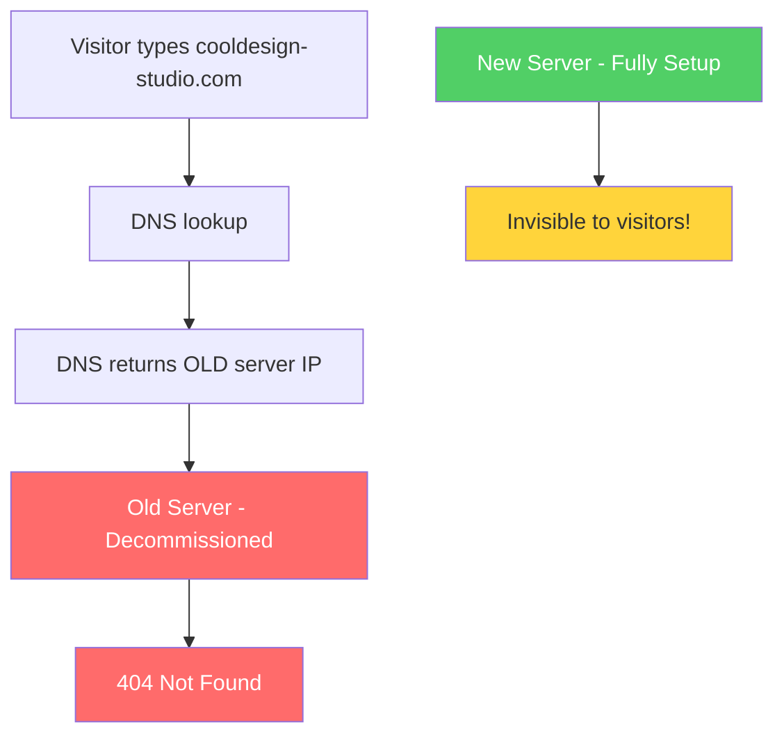
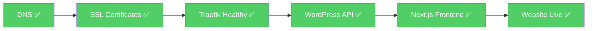

# When a Website Goes Dark: A Story of Detective Work, Docker, and DNS

*A real-world website recovery project — from silent outage to fully operational in one day.*

---

It started with a simple message from a client.

> *"Our website is down. Can you fix it? Also, can you update the framework while you're at it?"*

Short. Vague. No error message, no logs, no context. Just — down.

This is the story of how I brought **Cool Design Studio's** website back to life, updated their tech stack, and discovered that the real problem had absolutely nothing to do with their code.

---

## First Things First: Don't Touch Anything Yet

When a production website goes down, the worst thing you can do is start making changes before you understand what's broken. I've seen developers frantically restart servers, roll back deployments, or reinstall packages — only to make things worse.

My first move was to **take a backup**. Before touching a single file, I copied the entire application off the server onto my local machine. Only then did I start investigating.

The website ran on a modern stack: **Next.js** (the React framework) as the frontend, **WordPress** as the content backend, and **Traefik** as the reverse proxy sitting in front of everything — all running inside Docker containers on a cloud server.

---

## The First Clue: Error Logs

I pulled up the Next.js application logs and immediately saw this repeating over and over:

```
TypeError: fetch failed
[cause]: [Error: self-signed certificate]
{ code: 'DEPTH_ZERO_SELF_SIGNED_CERT' }
```

A self-signed certificate error. The app was trying to fetch content from the WordPress API and getting rejected because the SSL certificate wasn't trusted.

*Interesting.* But was this really the root cause, or just a symptom of something deeper?

I kept digging.

---

## The Plot Thickens: Traefik is Unhealthy

Next I checked the status of all the Docker containers running on the server:

```
nextjs_app    → healthy ✅
wordpress     → healthy ✅
traefik       → unhealthy ⚠️
```

Traefik — the component responsible for SSL certificates and routing traffic — was reporting as unhealthy. Its logs revealed this:

```
Error renewing certificate: [studio.cooldesign.com]
DNS problem: NXDOMAIN looking up A for studio.cooldesign.com
```

Let's Encrypt (the service that issues free SSL certificates) was trying to renew a certificate for one of the domains, but couldn't — because that domain didn't exist in DNS.

Now we were getting somewhere.

---

## The Big Discovery: A Server Nobody Told DNS About

I ran a simple DNS lookup to see where the website's domain was pointing:

```bash
nslookup www.cooldesign-studio.com 8.8.8.8
# Result: 111.x.x.x
```

Then I checked the actual server's IP address:

```bash
curl ifconfig.me
# Result: 103.x.x.x
```

**Two completely different IP addresses.**

The DNS records — the internet's address book — were pointing visitors to an old, decommissioned server. The new server, with all the code and content on it, was sitting there fully set up and operational, but completely invisible to the outside world.

I curled the old server to confirm:

```bash
curl -I http://111.x.x.x
# HTTP/1.1 302 Found → /404.html
# Server: Apache
```

The old server was dead. Redirecting everything to a 404 page. And it had a self-signed SSL certificate — which explained the error we saw in the Next.js logs.

Here's what was actually happening:



The website wasn't broken. It had simply been **migrated to a new server** at some point — but nobody had updated the DNS records to point to the new address. Every visitor, every API call, every SSL renewal attempt was still going to the old dead server.

---

## Fixing It: One Step at a Time

Once I understood the root cause, the fix became clear. But I took it methodically — no rushing.

### Step 1: Fix the DNS

I contacted the client and walked them through updating their DNS records in their domain provider (Vodien). Four A records needed to change:

| Domain | Old IP | New IP |
|--------|--------|--------|
| cooldesign-studio.com | 111.x.x.x | 103.x.x.x |
| www.cooldesign-studio.com | 111.x.x.x | 103.x.x.x |
| api.cooldesign-studio.com | 111.x.x.x | 103.x.x.x |
| cms.cooldesign-studio.com | 111.x.x.x | 103.x.x.x |

I also discovered a staging domain (`studio.cooldesign-studio.com`) referenced in their GitHub Actions deployment workflow that had no DNS record at all — which was the direct cause of Traefik's certificate renewal failure. I had that added too.

### Step 2: Fix Traefik's Healthcheck

While waiting for DNS to propagate, I noticed Traefik was marking itself unhealthy for a second reason — its own internal health check was broken.

The healthcheck was pinging port 80 (HTTP), but Traefik was configured to redirect all HTTP traffic to HTTPS. So the health check would ping itself, get redirected, fail SSL verification, and declare itself unhealthy. A classic self-inflicted wound.

The fix was simple — point the healthcheck to Traefik's internal API port instead:

```yaml
# Before (broken)
test: ["CMD-SHELL", "wget -q -O- http://localhost:80/ping || exit 1"]

# After (fixed)
test: ["CMD-SHELL", "wget -q -O- http://127.0.0.1:8080/ping || exit 1"]
```

### Step 3: Remove the Security Bypass

When the team had originally set up the new server, they encountered SSL errors (caused by the very DNS problem we just fixed) and worked around it by adding this to the codebase:

```
NODE_TLS_REJECT_UNAUTHORIZED=0
```

This tells Node.js to accept **any** SSL certificate — including expired, self-signed, or malicious ones. It's a known dangerous setting that should never exist in production.

Now that the real SSL issue was resolved, I removed this bypass from both the Dockerfile and the environment configuration, then rebuilt the container cleanly.

### Step 4: Verify Everything

Once DNS propagated globally, I ran a full suite of checks:



The website was back. Fully operational, with valid SSL certificates, clean logs, and no security bypasses.

---

## The Framework Update: More Important Than It First Seemed

With the site restored, I turned to the original request — update the Next.js framework.

But something had been nagging at me since I first opened the server logs. Before the site went down, there was this recurring noise in Traefik's logs:

```
Unsolicited response received on idle HTTP channel starting with
"://[redacted]/toto-39/">Agen judi online terlengkap"
```

Gambling spam. Injected directly into the server's HTTP responses. This wasn't just background internet noise — this kind of injection is a known signature of a compromised or vulnerable web server being exploited.

The client had mentioned seeing signs of this before the outage. Now I was looking at the likely reason why.

Outdated software doesn't just slow things down — it leaves **publicly known security holes** that bad actors actively scan for and exploit. Think of it like leaving a window unlocked in a neighbourhood where people are known to check for exactly that. The spam traffic was almost certainly a consequence of running dependencies with known vulnerabilities.

So the framework update wasn't just a routine housekeeping task anymore. It was a security necessity.

I audited the installed packages and updated everything that had fallen behind — Next.js, React, and the supporting dependencies — to their latest stable versions. I also updated the WordPress plugins (Yoast SEO and the active theme) and removed the SSL bypass that had been quietly sitting in the codebase.

Then I rebuilt the entire container from scratch. Clean slate. No leftovers from the old configuration.

The result: a codebase that was not only functional again, but meaningfully more secure than it was before the outage — with no known vulnerabilities in its dependencies and no dangerous configuration shortcuts hiding in the environment files.

---

## What I Learned (And What You Can Take Away)

**1. Never skip the backup.** No matter how urgent the situation feels, taking a backup before touching anything is non-negotiable. It takes 5 minutes and can save hours of recovery work.

**2. Understand before you fix.** The temptation to start making changes immediately is strong. But investing time to fully understand the problem first almost always leads to a faster, cleaner resolution.

**3. Error messages are clues, not conclusions.** The self-signed certificate error looked like an SSL problem. It was actually a DNS problem. Always ask: *is this the root cause, or a symptom?*

**4. Security shortcuts have expiry dates.** The `NODE_TLS_REJECT_UNAUTHORIZED=0` bypass was added as a quick fix and forgotten. Quick fixes in production have a way of becoming permanent — and dangerous — if nobody cleans them up.

**5. Communication is part of the job.** The DNS fix required the client to take action. Being able to explain a technical problem clearly to a non-technical person — without overwhelming them — is just as important as knowing how to fix it.

---

## Tech Stack Used

`Next.js 15` · `React 19` · `WordPress` · `Docker` · `Traefik` · `MySQL` · `Node.js 20` · `Let's Encrypt` · `WP-CLI`

---

*Enjoyed this write-up? I document my projects to share what I learn along the way. Feel free to reach out if you want to talk shop.*
